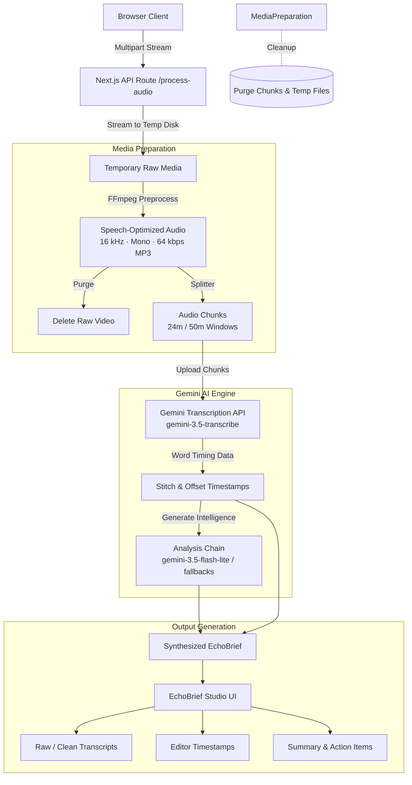

# 🎙️ EchoBrief

> **Audio & video intelligence for messy media.**  
> Turn raw voice memos, messy recordings, and multi-gigabyte videos into clean transcripts, structured executive briefs, translations, action items, and editor-ready timestamped cuts.

---

[](https://nextjs.org/)
[](https://react.dev/)
[](https://www.typescriptlang.org/)
[](https://tailwindcss.com/)
[](https://ai.google.dev/)
[](https://ffmpeg.org/)
[](./package.json)

---

## 🌟 Overview

**EchoBrief** transforms unorganized voice recordings, team meetings, video footage, and podcasts into structured, high-value intelligence. 

Version **3.0.0** introduces a high-performance media pipeline engineered to process large audio and video files without loading massive payloads into Node.js memory. Uploads are streamed straight to disk, converted into speech-optimized MP3 streams via FFmpeg, chunked with time offsets, transcribed using Gemini's dedicated transcription model, and merged back into unified, continuous outputs.

---

## 🎯 Core Workflows

EchoBrief provides two specialized operating modes tailored to your workflow:

| Feature | 📝 Notes Mode | ⏱️ Timestamp Mode |
| :--- | :--- | :--- |
| **Best For** | Voice notes, team meetings, lectures, spontaneous ideas | Video editing, YouTube hooks, podcasts, interviews, film |
| **Chunk Window** | 50-minute chunks | 24-minute chunks |
| **Raw & Clean Transcripts** | ✅ Included | ✅ Included |
| **Word-Timed Transcription** | — | ✅ Word-level timing metadata |
| **Editor-Ready Timestamps** | — | ✅ Range blocks (e.g., `[00:00] - [00:07]`) |
| **English Translation** | ✅ Included | ✅ Included |
| **Executive Summary** | ✅ Included | ✅ Included |
| **Action Items & Deadlines** | ✅ Structured checklist | ✅ Structured checklist |
| **Key Points & Unclear Parts** | ✅ Included | ✅ Included |

### ⏱️ Timestamp Mode Example Output

```text
[00:00] - [00:07] This is the opening section of the video.
[00:07] - [00:14] Here is the line I want to use as the hook.
[00:14] - [00:22] The speaker moves into the main topic.
```

---

## 🚀 What's New in v3.0

- 🎛️ **Studio Dark Interface**: Completely redesigned interface built for media workflows with tabbed output views, quick-copy, and `.txt` exports.
- ⚡ **Multi-Gigabyte Streaming Uploads**: Uses Busboy to stream multipart uploads directly to temporary disk storage, bypassing Node.js buffer limits.
- 🔊 **Speech-Optimized Audio Pipeline**: Automatically converts video files into lightweight, speech-tuned MP3s (**16 kHz • mono • 64 kbps**) with FFmpeg before transcription.
- 🧩 **Smart Audio Chunking**: Automatically slices long audio into safe windows while calculating precise time offsets to stitch back seamless, continuous timelines.
- 🧠 **Dedicated Gemini Model Routing**:
  - **Transcription**: Powered by `gemini-3.5-transcribe` through the Interactions API for high-accuracy word timestamps.
  - **Structured Analysis & Notes**: Multi-model fallback chain (`gemini-3.5-flash-lite` ➔ `gemini-3.6-flash` ➔ `gemini-3.8-flash`) ensuring resilient completions even under high API load.
- 📑 **Interactive Multi-File Queue**: Add multiple audio/video files, re-order them via manual controls, remove individual items, and batch process in sequence.
- 🧹 **Automatic Cleanup**: Removes temporary video files immediately after audio extraction and purges all intermediate chunks upon job completion or failure.

---

## 🏗️ Architecture & Pipeline



---

## 📁 Supported Media Formats

EchoBrief accepts common audio and video formats directly:

### 🎧 Audio Formats
`MP3` • `WAV` • `M4A` • `AAC` • `FLAC` • `WEBM` • `OGG` • `OPUS`

### 🎬 Video Formats
`MP4` • `MOV` • `MKV` • `M4V` • `AVI` • `WEBM` • `MPEG / MPG` • `WMV`

> *Video files are automatically converted locally using bundled `ffmpeg-static` prior to AI ingestion.*

---

## 🛠️ Tech Stack

- **Framework**: [Next.js 16 (App Router)](https://nextjs.org/)
- **UI & Components**: [React 19](https://react.dev/), [Tailwind CSS v4](https://tailwindcss.com/)
- **Language**: [TypeScript](https://www.typescriptlang.org/)
- **AI Models**: [Google Gen AI SDK (`@google/genai`)](https://www.npmjs.com/package/@google/genai)
  - Transcription: `gemini-3.5-transcribe`
  - Notes & Extraction: `gemini-3.5-flash-lite`, `gemini-3.6-flash`, `gemini-3.8-flash`
- **Media Processing**: [FFmpeg](https://ffmpeg.org/) via [`fluent-ffmpeg`](https://www.npmjs.com/package/fluent-ffmpeg) & [`ffmpeg-static`](https://www.npmjs.com/package/ffmpeg-static)
- **Streaming Ingestion**: [`busboy`](https://www.npmjs.com/package/busboy)

---

## ⚡ Getting Started

### 1. Prerequisites

- **Node.js**: `v20.x` or higher recommended
- **npm**, **pnpm**, or **yarn**
- A **Google Gemini API Key** ([Get one here](https://aistudio.google.com/app/apikey))

### 2. Clone the Repository

```bash
git clone https://github.com/TalalNA12/echobrief.git
cd echobrief
```

### 3. Install Dependencies

```bash
npm install
```

> **Note**: If upgrading from an earlier version, ensure `busboy` and its types are installed:
> ```bash
> npm install busboy
> npm install -D @types/busboy
> ```

### 4. Configure Environment Variables

Create a `.env.local` file in the root directory:

```env
# Required: Google Gemini API Key
GEMINI_API_KEY=your_gemini_api_key_here

# Transcription Model (Dedicated Gemini Transcription)
GEMINI_TRANSCRIBE_MODEL=gemini-3.5-transcribe

# Notes & Synthesis Models
GEMINI_NOTES_MODEL=gemini-3.5-flash-lite
GEMINI_NOTES_FALLBACK_MODELS=gemini-3.6-flash,gemini-3.8-flash

# Optional Configuration
NEXT_PUBLIC_APP_URL=http://localhost:3000
ECHOBRIEF_MAX_UPLOAD_BYTES=8589934592 # 8 GiB default max upload limit
```

### 5. Launch the Development Server

```bash
npm run dev
```

Open [http://localhost:3000](http://localhost:3000) in your browser to start using EchoBrief.

---

## ⚙️ Environment Configuration Reference

| Variable | Required | Default | Description |
| :--- | :---: | :--- | :--- |
| `GEMINI_API_KEY` | **Yes** | — | Google Gemini API secret key. |
| `GEMINI_TRANSCRIBE_MODEL` | No | `gemini-3.5-transcribe` | Primary model for audio transcription & word timestamps. |
| `GEMINI_NOTES_MODEL` | No | `gemini-3.5-flash-lite` | Primary model for brief extraction, summaries, and action items. |
| `GEMINI_NOTES_FALLBACK_MODELS` | No | `gemini-3.6-flash,gemini-3.8-flash` | Comma-delimited list of fallback models if primary model is rate-limited. |
| `ECHOBRIEF_MAX_UPLOAD_BYTES` | No | `8589934592` (8 GiB) | Maximum total payload size allowed by the streaming parser. |
| `NEXT_PUBLIC_APP_URL` | No | `http://localhost:3000` | Application base URL. |

---

## 💡 Large-File Handling & Resource Safety

EchoBrief v3 is specifically engineered to handle multi-gigabyte media safely:

1. **Zero-Buffer Ingestion**: Media is piped via Node streams directly to OS temporary disk files, preventing V8 memory bloat and `JavaScript heap out of memory` errors.
2. **Disk Capacity Planning**: When uploading a 4 GB video, ensure the server host has at least **~5–6 GB** of temporary disk space available to accommodate:
   - The initial video stream
   - The extracted speech-only MP3 (~15–30 MB per hour)
   - Temporary audio chunks
3. **Immediate Purge**: The source video is unlinked as soon as FFmpeg completes audio conversion.
4. **Robust Error Cleanup**: File unlinking triggers inside `finally` blocks, ensuring no leaked artifacts remain if an upload is aborted or an API call fails.

> **Production Tip**: For multi-gigabyte production workloads, deploy EchoBrief to a container or long-running virtual machine (e.g. Docker, Railway, Fly.io, AWS EC2) rather than standard serverless functions that enforce short execution timeouts (10–60s) and small payload caps.

---

## 🗺️ Roadmap

- [ ] Real-time backend progress events (uploading, extracting, chunking, transcribing).
- [ ] Export formats: `.srt`, `.vtt`, `.json`, and Markdown.
- [ ] Interactive waveform player synced with timestamp clicks.
- [ ] Diarization & multi-speaker recognition labels.
- [ ] Persistent job history & workspace management.
- [ ] Cloud storage integration (S3 / Cloudflare R2 / GCS).
- [ ] Async background processing queue with webhooks.

---

<div align="center">
  <sub> By <a href="https://github.com/TalalNA12">TalalNA12</a> · Powered by Google Gemini & Next.js</sub>
</div>